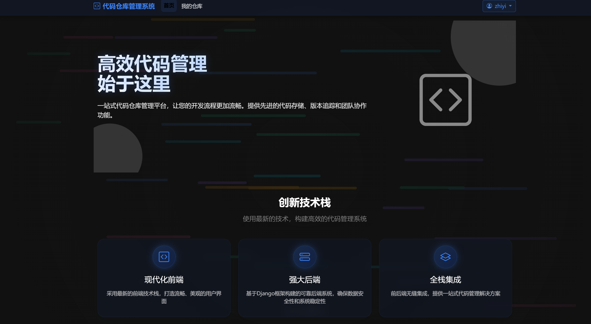

# CodeManage - 代码仓库管理系统

CodeManage 是一个基于 Django 开发的轻量级代码仓库管理系统，提供代码文件存储、版本管理和协作功能。系统界面美观，操作简单，是团队项目协作的理想工具。



## 功能特性

- **仓库管理**: 创建和管理多个代码仓库，对代码进行分类和整理
- **文件管理**: 上传和存储各种编程语言的代码文件
- **版本控制**: 代码文件支持版本管理，随时查看和下载历史版本
- **用户系统**: 支持用户注册、登录和权限管理
- **响应式设计**: 完美适配PC端和移动端设备
- **美观界面**: 基于Bootstrap 5.3设计的现代化界面，支持动画效果

## 技术栈

- **后端**: Django 5.2
- **前端**: 
  - HTML, CSS, JavaScript
  - Bootstrap 5.3
  - AOS.js (滚动动画库)
  - Bootstrap Icons
- **数据库**: SQLite (开发环境) / PostgreSQL (生产环境)

## 安装指南

### 前提条件
- Python 3.10+
- pip (Python包管理工具)

### 安装步骤

1. 克隆仓库
```bash
git clone https://github.com/yourusername/codemanage.git
cd codemanage
```

2. 创建并激活虚拟环境
```bash
# Windows
python -m venv venv
venv\Scripts\activate

# Linux/Mac
python -m venv venv
source venv/bin/activate
```

3. 安装依赖
```bash
pip install -r requirements.txt
```

4. 执行数据库迁移
```bash
python manage.py migrate
```

5. 创建管理员账户
```bash
python manage.py createsuperuser
```

6. 启动开发服务器
```bash
python manage.py runserver
```

7. 访问系统
- 网站: http://127.0.0.1:8000/
- 管理后台: http://127.0.0.1:8000/admin/

## 使用说明

### 注册与登录
1. 新用户需要先完成注册
2. 已有账户的用户可直接登录

### 仓库管理
1. 登录后，点击"创建仓库"按钮创建新仓库
2. 填写仓库名称、描述等信息
3. 在仓库列表页可以查看和管理所有仓库

### 文件管理
1. 进入仓库详情页，点击"上传文件"按钮
2. 选择要上传的文件并填写相关信息
3. 上传完成后可在文件列表中查看和管理文件

### 版本管理
1. 进入文件详情页面可以查看文件的所有版本
2. 点击"上传新版本"按钮可以更新文件
3. 每个版本都可以单独下载和查看

## 贡献指南

1. Fork 本仓库
2. 创建您的特性分支 (`git checkout -b feature/amazing-feature`)
3. 提交您的更改 (`git commit -m 'Add some amazing feature'`)
4. 推送到分支 (`git push origin feature/amazing-feature`)
5. 开启一个 Pull Request

## 许可证

本项目采用 MIT 许可证 - 详见 [LICENSE](LICENSE) 文件

## 联系方式

项目维护者 - your.email@example.com

项目链接: [https://github.com/yourusername/codemanage](https://github.com/yourusername/codemanage)